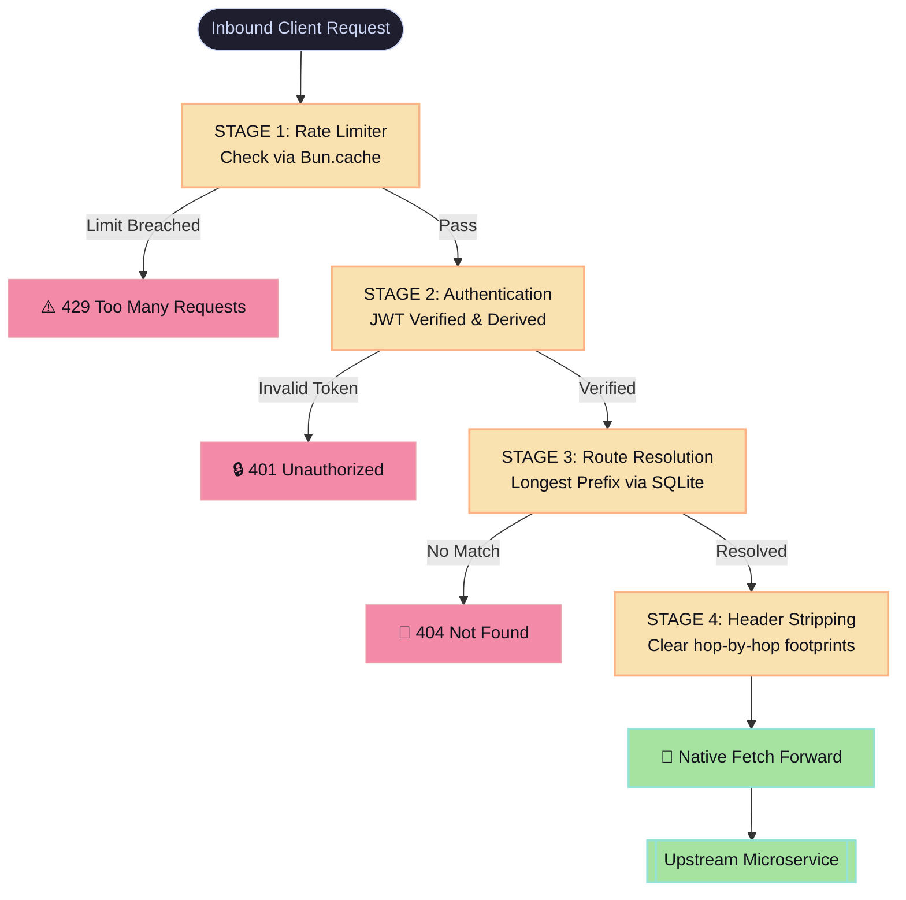

# ⚡ BriskRoute

<div align="center">
  
  <p><h3>Edge-Native, Blazing-Fast High-Throughput API Gateway</h3></p>

  [](https://bun.sh)
  [](https://elysiajs.com)
  [](https://sqlite.org)
  [](https://www.typescriptlang.org)
  [](LICENSE)
</div>

---

**BriskRoute** is a lightweight, zero-dependency infrastructure block designed to intercept, filter, authorize, and route massive traffic volumes with minimal memory allocation. Powered by **Bun** and **ElysiaJS**, it matches the performance of Go and FastAPI pipelines while preserving strict, end-to-end TypeScript safety.

## 🚀 Key Features

*   **Ultra-Fast Reverse Proxy:** Non-blocking connection proxying using optimized native `Bun.fetch()`.
*   **Longest Prefix Matching:** Dynamic route resolution backed by highly indexed embedded SQLite tables.
*   **Stateful Memory Buffering:** In-memory configuration seeding and token execution verification.
*   **Pre-emptive Rate Limiting:** High-speed IP tracking running directly on the connection layer before expensive auth parsing.
*   **Cryptographic Verification:** Sub-millisecond JWT decoding lifecycle attachments.

---

## 🗺️ Architectural Workflow

Every request hitting the entry gate traverses a strict non-blocking lifecycle pipeline:



---

## 🛠️ Tech Stack & Dependencies

*   **Runtime Engine:** Bun 1.3+ (Built on WebKit's JavaScriptCore)
*   **Web Standard:** ElysiaJS (TypeBox data validation ecosystem)
*   **Engine Storage:** Built-in `bun:sqlite` (Running WAL mode for safe concurrent performance)
*   **Encryption Engine:** `@elysiajs/jwt`

---

## 🏁 Quick Start

### Prerequisites
Verify that your machine is running a modern Bun runtime instance:
```bash
bun --version
```

### Installation
Instantly pull and link lockfile bindings without network bloating:
```bash
bun install
```

### Running Pipelines
Launch with hot-reload watch environments active for micro-service iteration:
```bash
bun run dev
```

Compile hooks and optimize memory profiles for high-performance production runtimes:
```bash
bun run start
```
The gateway listens at: `http://localhost:3000`

---

## ⚙️ Environment Variables

Tailor operational metrics via root environments or `.env` parameters:

| Variable | Default Value | Description |
| :--- | :--- | :--- |
| `PORT` | `3000` | Gateway listener port bound to the loopback. |
| `JWT_SECRET` | `replace-with-secure-secret` | Cryptographic signature validation key. |
| `DEFAULT_UPSTREAM` | `http://localhost:4000` | Automated fallback seed for the baseline `/api` routing prefix. |
| `BRISKTROUTE_DB_PATH` | `.data/briskroute.sqlite` | SQLite state storage node path (Automatically git-ignored). |
| `RATE_LIMIT_WINDOW_MS`| `60000` | Sizing block for traffic window calculations. |
| `RATE_LIMIT_MAX` | `120` | Threshold of maximum allowed atomic queries within window. |

---

## 📡 Operational Control Interface

### 1. Gateway Verification
```bash
curl http://localhost:3000/_gateway/health
```
**Response (`200 OK`):**
```json
{
  "status": "ok",
  "service": "BriskRoute"
}
```

### 2. Runtime Dynamic Route Registration
Registers an explicit routing map inside the state engines instantly:
```bash
curl -X POST http://localhost:3000/_gateway/routes \
  -H 'content-type: application/json' \
  -d '{"prefix":"/api","target":"http://localhost:4000"}'
```
**Response (`201 Created`):**
```json
{
  "prefix": "/api",
  "target": "http://localhost:4000"
}
```

> **Prefix Resolution Engine:** Routing applies a strict longest-prefix strategy. If `/api` maps to server A, and `/api/users` maps to server B, an incoming request targeting `/api/users/profile` is cleanly isolated and mapped directly to server B.

---

## 🔒 Security & Boundary Control

### Header Cleansing Strategy
To prevent architectural footprint leakages and protect internal networks, the proxy engine automatically scrubs hop-by-hop bindings from outgoing streams:
*   `connection`, `keep-alive`, `te`, `trailer`
*   `proxy-authenticate`, `proxy-authorization`
*   `transfer-encoding`, `upgrade`, `host`

### Token Requirements
Endpoints mounted past root validation require authentic Bearer headers:
```text
Authorization: Bearer <jwt_payload_token>
```
Claims are parsed to guarantee state parameters match:
```json
{
  "sub": "user-id-string",
  "scope": "optional-authorization-scope"
}
```

---

## 📊 Performance Benchmarks

Conducted locally using `autocannon` targeting loopback adapters.
*   **Engine Specs:** Bun `1.3.14-canary.1` (Single process allocation, SQLite WAL engine active, Rate-limiting lifted to avoid active test interference).

### 📈 Throughput Profiles (Higher is Better)

| Target Pipeline | Concurrency | Pipeline | Requests / Second | Visual Distribution |
| :--- | :---: | :---: | :---: | :--- |
| **Direct Target Upstream** (`/health`) | 100 | 10 | **11,176 rps** | `🔵🔵🔵🔵🔵🔵🔵🔵🔵🔵🔵🔵🔵🔵🔵` |
| **Gateway Native Diagnostics** (`/_gateway/health`) | 100 | 10 | **5,014 rps** | `🔵🔵🔵🔵🔵🔵` |
| **Authenticated Proxy** (`/api/health`) | 10 | 1 | **11,857 rps** | `🟢🟢🟢🟢🟢🟢🟢🟢🟢🟢🟢🟢🟢🟢🟢🟢` |
| **Authenticated Proxy** (`/api/health`) | 50 | 1 | **12,387 rps** | `🟢🟢🟢🟢🟢🟢🟢🟢🟢🟢🟢🟢🟢🟢🟢🟢🟢` |
| **Authenticated Proxy** (`/api/health`) | 100 | 1 | **12,158 rps** | `🟢🟢🟢🟢🟢🟢🟢🟢🟢🟢🟢🟢🟢🟢🟢🟢` |

### ⏱️ P99 Latency Distributions (Lower is Better)

| Target Pipeline | Concurrency | P99 Tail Latency | Visual Latency Bar |
| :--- | :---: | :---: | :--- |
| **Direct Target Upstream** (`/health`) | 100 | **105.00 ms** | `🟡🟡🟡🟡🟡🟡🟡` |
| **Gateway Native Diagnostics** (`/_gateway/health`) | 100 | **228.00 ms** | `🔴🔴🔴🔴🔴🔴🔴🔴🔴🔴🔴🔴🔴🔴🔴` |
| **Authenticated Proxy** (`/api/health`) | 10 | **2.00 ms** | `🟢` |
| **Authenticated Proxy** (`/api/health`) | 50 | **8.00 ms** | `🟢` |
| **Authenticated Proxy** (`/api/health`) | 100 | **16.00 ms** | `🟢🟢` |

> **Systems Engineering Finding:** Pipelined proxy tasks with `-p 10` introduced internal thread queuing over loopback adapters. Standard keep-alive operations sustain an exceptional `~12,000 rps` threshold with tail latency effectively capped below `16 ms` under high concurrency.

---

## 🛡️ Compilation & Structural Assurance

Ensure full production reliability before deployment pipelines execute:

```bash
bun run typecheck       # Enforce strict TypeScript compilation checks
bun test                # Run unit suites verifying prefix resolution blocks
```

---

## 📂 Project Component Schema

```text
src/
├── config/
│   ├── database.ts        # Database instantiation and WAL configuration
│   └── database.test.ts   # Integrity suites for index validation
├── plugins/
│   ├── auth.ts            # Fast cryptographic validation token parsing
│   └── rateLimit.ts       # Connection-level safety gate tracking
├── routes/
│   └── proxy.ts           # Reverse routing and header scrubbing controls
└── index.ts               # Core execution hook
scripts/
├── jwt-token.ts           # Token generation helpers for load simulations
└── upstream.ts            # High-speed echo environment for benchmarking
```

---
*Built with speed, safety, and modern runtime architecture.*